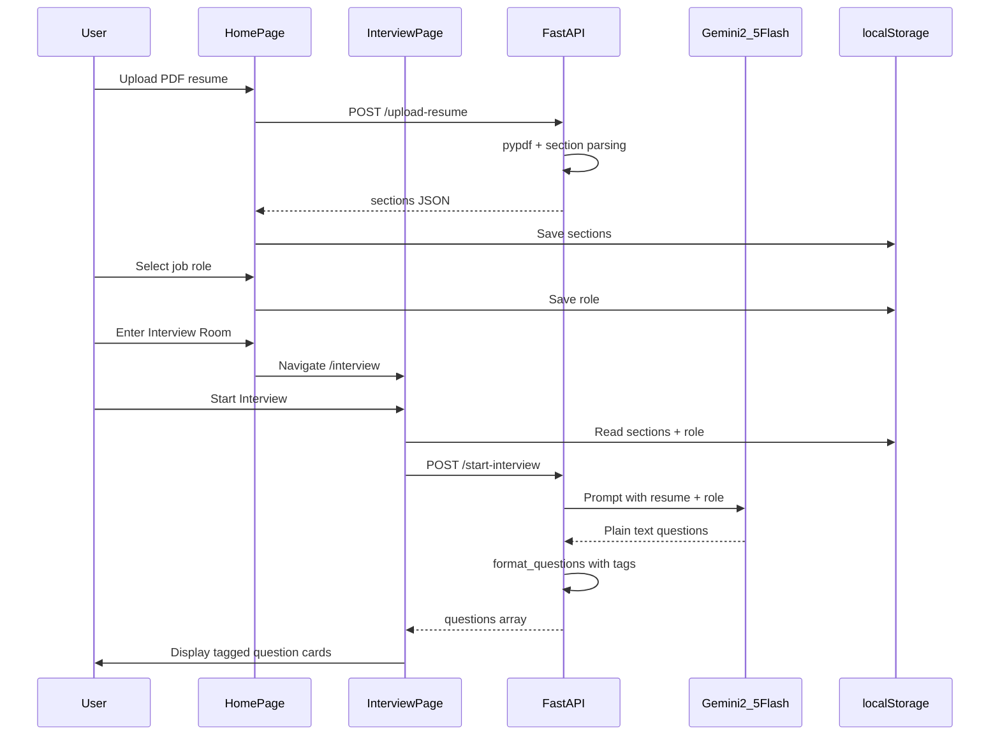

# AI Interview Copilot — Project Understanding

> **Living document.** Update this file whenever features, structure, or repo setup change.

---

## Changelog

| Date | Change |
|------|--------|
| 2026-05-29 | Initial project audit and architecture summary |
| 2026-05-29 | GitHub hygiene: root `.gitignore`, `backend/requirements.txt`, `backend/.env.example`, project README |
| 2026-05-29 | Security: removed API key stdout logging from `settings.py` |
| 2026-05-29 | Cleanup: deleted unused `ResumeUpload.tsx` and `RoleSelector.tsx` |
| 2026-05-29 | Backend: `StartInterviewRequest` Pydantic model wired in `/start-interview` |
| 2026-05-29 | Frontend: `Home.tsx` resume upload now uses shared `api` axios client |
| 2026-05-29 | Git init + first commit on `main` |
| 2026-05-29 | Private GitHub repo created and pushed: `NishthaSingh7/ai-interview-copilot` |

---

## What This Project Is

**AI Interview Copilot** is a web app that helps candidates prepare for technical interviews by:
1. Uploading a PDF resume
2. Selecting a target job role
3. Getting AI-generated interview questions tailored to their resume and role

The product vision (shown on the Home page) includes RAG-based smart questions and AI evaluation, but **only resume upload + question generation are implemented today**.

---

## Tech Stack

### Languages
| Layer | Language |
|-------|----------|
| Frontend | **TypeScript** |
| Backend | **Python 3.12** |

### Frontend Libraries & Tools
| Category | Technology |
|----------|------------|
| UI framework | **React 19** |
| Build tool | **Vite 8** |
| Routing | **react-router-dom v7** |
| HTTP client | **axios** (centralized in `services/api.ts`) |
| Styling | **Tailwind CSS 3** + CSS custom properties |
| Font | Google Font **Outfit** |
| Compiler | **React Compiler** |
| Linting | **ESLint 9** + typescript-eslint |

### Backend Libraries & Tools
| Category | Technology |
|----------|------------|
| API framework | **FastAPI** |
| AI / LLM | **Google Generative AI** — model `gemini-2.5-flash` |
| PDF parsing | **pypdf** |
| Config | **python-dotenv** |
| Validation | **Pydantic** (`StartInterviewRequest`, `ResumeSections`) |
| Server | **uvicorn** |

Dependencies pinned in [`backend/requirements.txt`](backend/requirements.txt).

### Browser APIs (planned)
- **Web Speech API** via `useSpeechToText.ts` — implemented but not wired into any page

---

## Project Structure

```
ai-interview-copilot/
├── .gitignore             # Root gitignore (venv, .env, node_modules, dist)
├── README.md              # Project setup and run instructions
├── .cursor/plans/         # This living project tracker
├── backend/
│   ├── main.py
│   ├── .env               # Local secrets (gitignored)
│   ├── .env.example       # Template for GEMINI_API_KEY
│   ├── requirements.txt
│   ├── config/settings.py
│   ├── models/schemas.py  # StartInterviewRequest, ResumeSections
│   ├── routes/
│   │   ├── interview.py
│   │   └── resume.py
│   ├── services/
│   │   ├── question_generator.py
│   │   └── resume_parser.py
│   └── venv/              # gitignored
└── frontend/
    ├── src/
    │   ├── pages/         # Home, Interview, Feedback
    │   ├── components/    # Sidebar, ThemeToggle
    │   ├── hooks/         # useTheme (used), useSpeechToText (unused)
    │   └── services/api.ts
    └── .gitignore
```

---

## Current Features (Implemented vs Planned)

### Implemented
| Feature | Where |
|---------|-------|
| PDF resume upload | Home → `POST /upload-resume` via axios |
| Heuristic resume parsing | `resume_parser.py` |
| Role selection (9 roles) | Home page |
| AI question generation via Gemini | `POST /start-interview` |
| Pydantic request validation | `StartInterviewRequest` in `schemas.py` |
| Tagged question display | Interview page |
| Sidebar navigation | `Sidebar.tsx` |
| Dark / light theme | `useTheme.ts` + `ThemeToggle.tsx` |
| Fallback questions if Gemini fails | `interview.py` |
| GitHub-ready repo hygiene | `.gitignore`, `requirements.txt`, `.env.example`, README |

### Not Implemented
| Feature | Status |
|---------|--------|
| RAG / vector retrieval | Marketing copy only |
| AI answer evaluation | Feedback page placeholder |
| Speech-to-text answers | Hook exists, not connected |
| Interactive Q&A loop | Questions display only |
| Session history / persistence | `localStorage` only |
| User authentication | None |
| Route guards | None |
| Git init / GitHub remote | Done — [github.com/NishthaSingh7/ai-interview-copilot](https://github.com/NishthaSingh7/ai-interview-copilot) (private) |

---

## Application Flow



---

## Backend API Surface

| Method | Endpoint | Request | Response |
|--------|----------|---------|----------|
| GET | `/` | — | `{ message }` |
| POST | `/upload-resume` | PDF file (multipart) | `{ sections }` |
| POST | `/start-interview` | `StartInterviewRequest` | `{ questions: [{ question, tag }] }` |

---

## State & Data Model

- **No database** — client-side `localStorage` only
- **Keys:** `sections` (parsed resume JSON), `role` (selected role string)
- **Backend is stateless** per request

---

## Git / GitHub Readiness

| Item | Status |
|------|--------|
| Root `.gitignore` | Done |
| `backend/requirements.txt` | Done |
| `backend/.env.example` | Done |
| Project README | Done |
| API key not logged to stdout | Done |
| `backend/.env` excluded from git | Done (via `.gitignore`) |
| `git init` | Done |
| GitHub remote / first push | Done (private, `main`) |

**Note:** If the API key was ever shared or committed elsewhere, rotate it in Google AI Studio.

---

## Maturity Summary

Working MVP for **setup → personalized question generation**. UI shell is in place for feedback, speech input, and scoring — those remain to be built. Folder structure is sound; no redesign needed.
